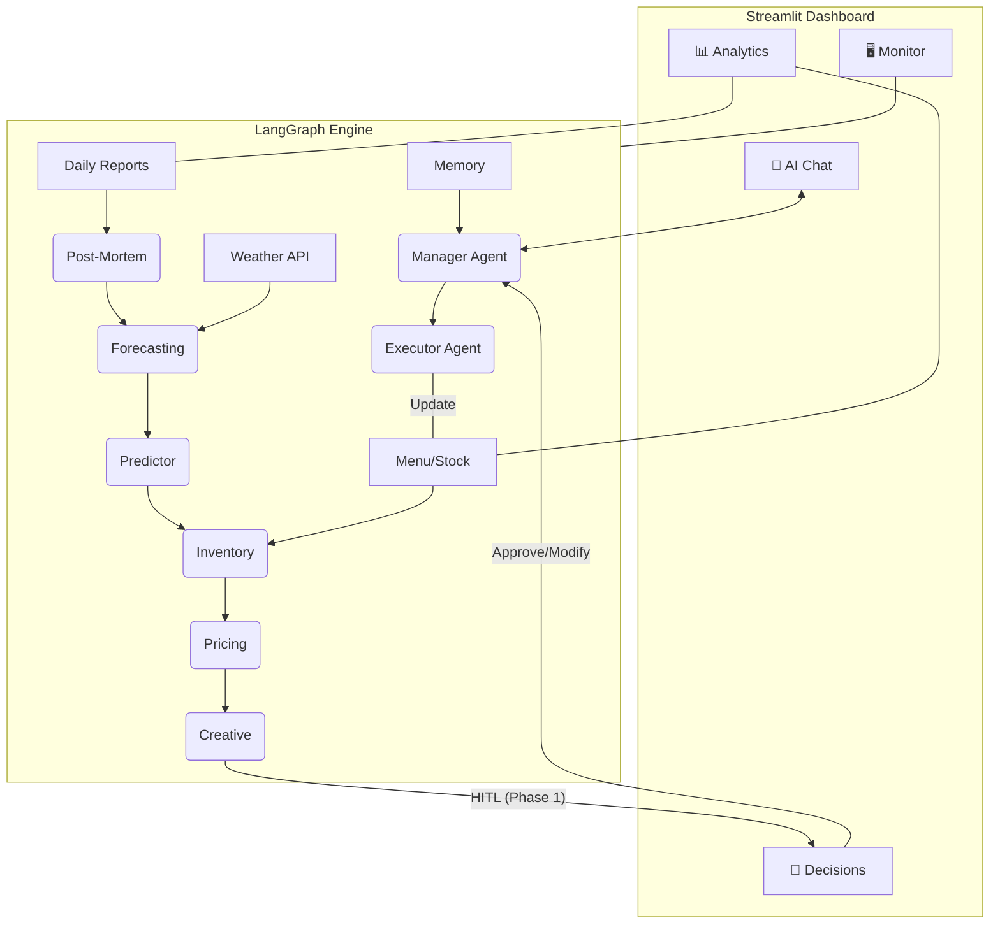

# KafeAI v2 - AI COO for Smart Restaurant Management

KafeAI 是一个面向餐饮管理者的**智能决策中枢**。系统通过多 Agent 协同工作，整合历史销售数据、实时天气预报、库存状态及市场活动，为餐厅提供全方位的经营建议与自动化执行能力。

V2 版本实装了全新的 **Streamlit 可视化管理中心**，实现了从 CLI 到 GUI 的全面转型。

---

## 🚀 项目定位 (Project Orientation)
- **目标用户**：欧洲（瑞典为主）及北美餐饮管理者。
- **核心价值**：从“事后查看报表”转变为“事前预测决策”与“自动化运营”。
- **交互体验**：极简且富有高级感的 GUI 系统，深度集成 LangGraph “人类在环 (HITL)” 审核机制。

---

## 🏗️ 核心架构 (Architecture Diagram)



---

## 🏁 快速开始 (Quick Start)

### 1. 环境准备 (Prerequisites)
- **Python**: 3.10+
- **API Keys**: Google Gemini API Key, Weather API Key (OpenWeatherMap).
- **安装依赖**:
  ```bash
  # 安装后端依赖
  pip install -r kafeAI/requirements.txt
  # 安装前端依赖
  pip install -r kafeAI/frontend/requirements_frontend.txt
  ```

### 2. 配置文件
系统内置可视化配置页面，您也可以手动在 `./kafeAI/` 目录下创建 `.env`：
```env
GOOGLE_API_KEY=your_gemini_key
WEATHER_API_KEY=your_weather_key
CITY=Sundsvall
```

### 3. 运行可视化中心
```bash
cd kafeAI/frontend
python -m streamlit run app.py --server.port 8502
```
访问 `http://localhost:8502` 即可进入管理后台。

---

## 🌟 核心功能模块

| 模块 | 功能说明 |
|------|----------|
| **AI 对话中心** | 与 AI 运营助手实时对话，流式输出 Agent 思考过程。 |
| **决策审核 (HITL)** | 视觉化呈现 Agent 建议与海报模板，支持一键审批或修改指令。 |
| **数据透视 (Analytics)** | 实时销售趋势图、品类占比统计及动态库存预警。 |
| **文件实验室** | 侧边栏集成在线编辑器，可直接修改 `Menu.md`、`stock.json` 及上传日报。 |
| **健康监测** | 实时追踪各 Agent 节点运行状态及服务器硬件资源占用。 |

---

## 📂 目录结构说明

- **`kafeAI/manageragent.py`**: 后端核心，定义了 LangGraph 工作流。
- **`kafeAI/frontend/`**: Streamlit 前端源码目录。
- **`Menu.md / stock.json`**: 餐厅“数字孪生”的核心数据库。
- **`memory.json`**: 基于 RAG 的强化学习记忆库。
- **`daily_reports/ / decision_history/`**: 存储历史报表与决策证据链。

---

## ⚖️ GDPR & 合规性
- **数据最小化**：仅处理订单 ID、时间、金额及菜品，不涉及个人敏感信息 (PII)。
- **完全本地化**：默认采用本地文件存储，关键业务数据不离开用户环境。

---

*Generated by Antigravity - Your Senior Technical Partner.*
