# KafeAI v2 - AI COO for Smart Restaurant Management

KafeAI is an **intelligent decision-making hub** designed for restaurant managers. By leveraging a multi-agent orchestration system, it integrates historical sales data, real-time weather forecasts, inventory statuses, and marketing activities to provide comprehensive operational insights and automated execution.

Version V2 introduces a brand-new **Streamlit Visualization Management Center**, marking a complete transformation from CLI to GUI.

---

## 🚀 Project Orientation
- **Target Users**: Restaurant managers in Europe (primarily Sweden) and North America.
- **Core Value**: Shifting from "post-event report analysis" to "pre-event predictive decision-making" and "automated operations."
- **Interaction Experience**: A minimalist and premium GUI system, deeply integrated with the LangGraph "Human-in-the-Loop (HITL)" review mechanism.

---

## 🏗️ Architecture Diagram

```mermaid
graph TD
    subgraph UI [Streamlit Dashboard]
        chat[💬 AI Chat]
        dec[🧠 Decisions]
        ana[📊 Analytics]
        mon[🖥️ Monitor]
    end

    subgraph Agents [LangGraph Engine]
        A[Daily Reports] --> B(Post-Mortem)
        B --> C(Forecasting)
        D[Weather API] --> C
        C --> E(Predictor)
        E --> F(Inventory)
        G[Menu/Stock] --> F
        F --> H(Pricing)
        H --> I(Creative)
        
        I -- "HITL (Phase 1)" --> dec
        dec -- "Approve/Modify" --> J(Manager Agent)
        K[Memory] --> J
        J --> L(Executor Agent)
        L -- Update --- G
    end

    chat <--> J
    ana --- A & G
    mon --- Agents
```



---

## 🏁 Quick Start

### 1. Prerequisites
- **Python**: 3.10+
- **API Keys**: Google Gemini API Key, Weather API Key (OpenWeatherMap).
- **Install Dependencies**:
  ```bash
  # Install backend dependencies
  pip install -r kafeAI/requirements.txt
  # Install frontend dependencies
  pip install -r kafeAI/frontend/requirements_frontend.txt
  ```

### 2. Configuration
The system includes a built-in visualization configuration page. Alternatively, you can manually create a `.env` file in the `./kafeAI/` directory:
```env
GOOGLE_API_KEY=your_gemini_key
WEATHER_API_KEY=your_weather_key
CITY=Sundsvall
```

### 3. Run the Visualization Center
```bash
cd kafeAI/frontend
python -m streamlit run app.py --server.port 8502
```
Navigate to `http://localhost:8502` to access the management dashboard.

---

## 🌟 Core Modules

| Module | Description |
|------|----------|
| **AI Chat Center** | Real-time interaction with an AI operations assistant, featuring streaming output of the agent's reasoning process. |
| **Decision Approval (HITL)** | Visual representation of agent suggestions and poster templates, supporting one-click approval or instruction overrides. |
| **Analytics Pivot** | Real-time sales trends, itemized category statistics, and dynamic inventory shortage alerts. |
| **File Lab** | Integrated online editor in the sidebar for direct modification of `Menu.md`, `stock.json`, and daily report uploads. |
| **Health Monitor** | Real-time tracking of Agent node execution status and server hardware resource utilization. |

---

## 📂 Directory Structure

- **`kafeAI/manageragent.py`**: Backend core defining the LangGraph workflow.
- **`kafeAI/frontend/`**: Source code directory for the Streamlit frontend.
- **`Menu.md / stock.json`**: Core database for the restaurant's "Digital Twin."
- **`memory.json`**: RAG-based reinforcement learning memory system.
- **`daily_reports/ / decision_history/`**: Storage for historical reports and decision evidence chains.

---

## ⚖️ GDPR & Compliance
- **Data Minimization**: Only handles order IDs, timestamps, amounts, and dish names. No Personally Identifiable Information (PII) is processed.
- **Full Localization**: Default local file storage ensures critical business data never leaves the user's controlled environment.

---

*Generated by Antigravity - Your Senior Technical Partner.*
