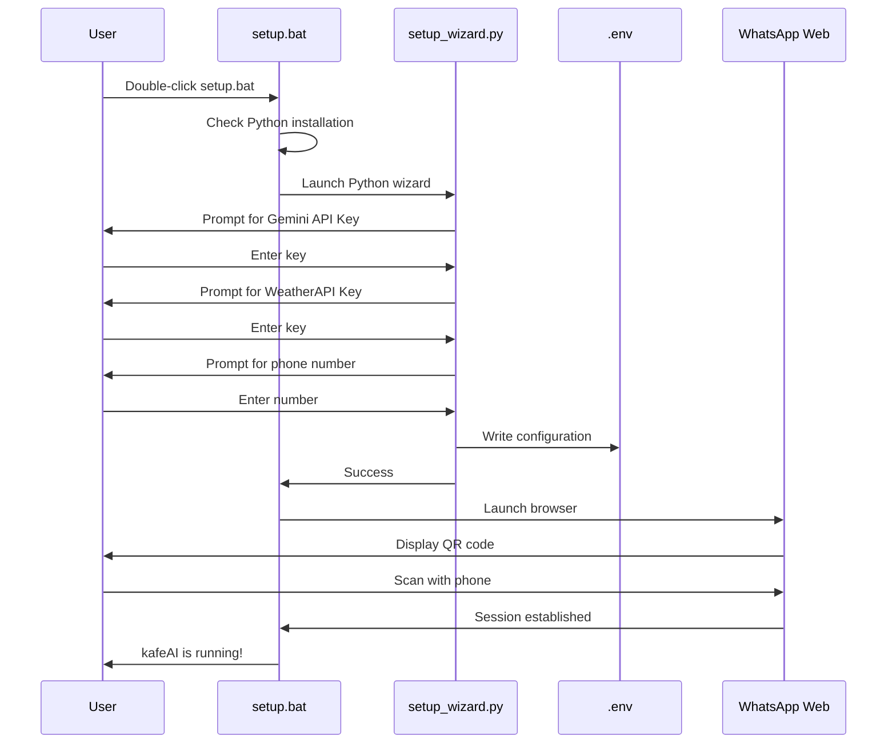
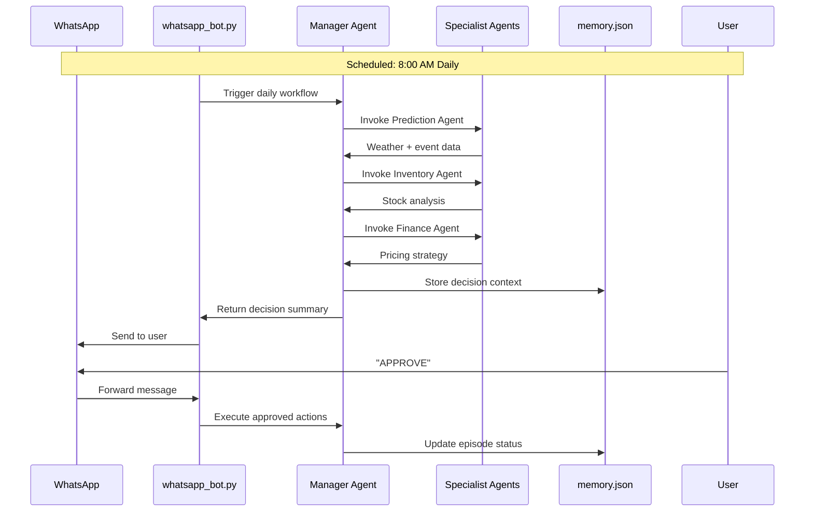
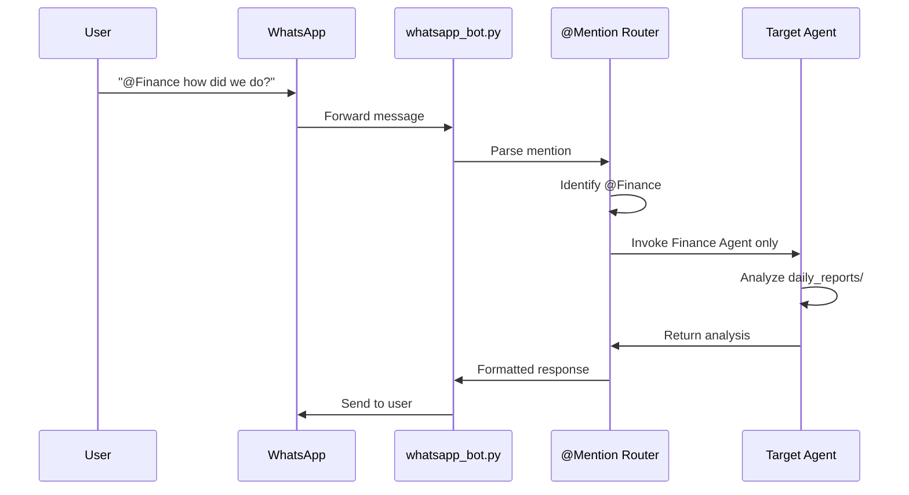

# 3. Architecture & Core Logic

This document explains the technical architecture of kafeAI — how agents collaborate, how data flows through the system, and how decisions are made.

---

## Agentic Framework

kafeAI is built on **LangGraph**, a state-machine framework for orchestrating multi-agent workflows. Unlike simple prompt chaining, LangGraph allows:

- **Stateful conversations**: Each agent can access shared context
- **Conditional routing**: Decisions about which agent runs next
- **Human-in-the-loop**: Pausing for approval at critical steps
- **Cycles and loops**: Supporting reinforcement learning over time

### The Agent Graph

```mermaid
graph TD
    A[Start] --> B[Manager Agent<br/>Router]
    B --> C{Query Type?}

    C -->|@Weather<br/>or Prediction| D[Prediction Agent]
    C -->|@Inventory| E[Inventory Agent]
    C -->|@Finance<br/>or @Pricing| F[Finance/Dynamic Pricing Agent]
    C -->|@Creative| G[Poster Agent]

    D --> H[Memory Update]
    E --> H
    F --> H
    G --> I[Asset Generation]

    H --> J[Human Approval?]
    J -->|Yes| K[Wait for User]
    K --> L{Approved?}
    L -->|Yes| M[Execute Action]
    L -->|No| N[Reject & Log]
    J -->|No| M

    M --> O[Post-Mortem Agent]
    N --> O
    O --> P[End]

    I --> P

    style B fill:#e1f5fe
    style O fill:#fff3e0
```

### Agent Responsibilities

| Agent | File | Purpose | Input | Output |
|-------|------|---------|-------|--------|
| **Manager** | `manageragent.py` | Routes queries, orchestrates workflow | User query, state | Next agent to invoke |
| **Prediction** | `manageragent.py` | Weather forecasting, demand signals | City config | Weather + event context |
| **Inventory** | `manageragent.py` | Stock analysis, reorder recommendations | `stock.json`, `Menu.md` | Inventory alerts |
| **Finance** | `dynamic_pricing_agent.py` | Revenue analysis, pricing optimization | Daily reports | Pricing recommendations |
| **Creative** | `poster_agent.py` | Marketing content generation | Promotional data | Poster image + text |
| **Post-Mortem** | `post_mortem_agent.py` | RL feedback, decision quality analysis | User feedback | Bias corrections |

---

## The "Memory" Layer

kafeAI implements a two-tier memory system inspired by human cognition:

### Short-Term Memory (State)

The `AgentState` dictionary passed between graph nodes:

```python
class AgentState(TypedDict):
    issue: str                    # Current user query
    context: Annotated[List[str], operator.add]  # Accumulated context
    decision: str                 # Final AI decision
    feedback: str                 # User feedback for RL
    promotion_data: dict          # Poster/campaign data
    poster_path: str              # Generated asset path
    target_date: str              # Date for RL tracking
    routing_mode: str             # "full" or "single" agent mode
    target_node: str              # Direct agent routing
```

### Long-Term Memory (Persistence)

#### 1. `memory.json` — Episodic Memory

Stores key business events and decisions for learning:

```json
{
  "episodes": [
    {
      "date": "2026-02-15",
      "prediction_summary": "Forecast: Sunny, -13.9°C. Rain: 0%",
      "decision": "Indoor Yield Maximization strategy...",
      "status": "PENDING",
      "bias_correction": ""
    }
  ],
  "global_bias": {
    "weather_sensitivity": 1.0,
    "event_optimism": 1.0
  }
}
```

**Purpose**: Reinforcement learning. When a prediction proves wrong (e.g., sunny forecast but low sales), the system adjusts its `global_bias` weights.

#### 2. `daily_reports/` — Historical Data

POS-integrated daily sales reports in structured JSON:

```json
{
  "report_info": {
    "report_type": "Z-DAGRAPPORT",
    "loop_number": 2447,
    "company_name": "Tant Anki & Fröken Sara AB",
    "period_start": "2026-02-16 21:04:30",
    "period_end": "2026-02-17 19:59:26"
  },
  "sales_summary": {
    "total_gross": 5114.00,
    "total_net": 4533.02,
    "total_vat": 580.98
  },
  "sales_by_category": [...],
  "payment_methods": {...},
  "performance_metrics": {
    "average_purchase_per_customer": 146.11
  }
}
```

**Purpose**: Pattern recognition, seasonal analysis, financial forecasting.

#### 3. `stock.json` — Real-Time Inventory

Current inventory levels with metadata:

```json
{
  "inventory": [
    {"item": "nötkött", "quantity": 20, "unit": "kg"},
    {"item": "burger bröd", "quantity": 3, "unit": "katon"}
  ],
  "metadata": {
    "last_updated": "2026-03-03 23:58:11",
    "source": "Menu.md"
  }
}
```

**Purpose**: Real-time operational decisions, reorder triggers.

#### 4. `Menu.md` — Product Catalog

Human-readable menu with storage targets:

```markdown
## 汉堡
Classic原味牛肉汉堡 (beef+ost+sallad+tomat+aioli) 120kr

## Storage
nötkött 10kg
burger bröd 1 katon
```

**Purpose**: Links sales items to inventory requirements.

---

## Workflow Flowchart

### Initialization Flow



### Runtime Flow (Full Pipeline)



### Runtime Flow (Single Agent Mode)



---

## Data Flow Architecture

```
┌────────────────────────────────────────────────────────────────────┐
│                         kafeAI Data Flow                           │
├────────────────────────────────────────────────────────────────────┤
│                                                                    │
│  INPUT SOURCES              PROCESSING LAYER          OUTPUTS      │
│  ─────────────              ────────────────          ───────      │
│                                                                    │
│  ┌──────────────┐          ┌──────────────┐         ┌──────────┐  │
│  │ WeatherAPI   │──────────▶│ Prediction   │         │ WhatsApp │  │
│  └──────────────┘          │ Agent        │─────────▶│ Messages │  │
│                            └──────────────┘         └──────────┘  │
│  ┌──────────────┐          ┌──────────────┐         ┌──────────┐  │
│  │ stock.json   │──────────▶│ Inventory    │         │ Stock    │  │
│  └──────────────┘          │ Agent        │─────────▶│ Updates  │  │
│                            └──────────────┘         └──────────┘  │
│  ┌──────────────┐          ┌──────────────┐         ┌──────────┐  │
│  │ daily_reports│──────────▶│ Finance      │         │ Pricing  │  │
│  └──────────────┘          │ Agent        │─────────▶│ Alerts   │  │
│                            └──────────────┘         └──────────┘  │
│  ┌──────────────┐          ┌──────────────┐         ┌──────────┐  │
│  │ User Query   │──────────▶│ Creative     │         │ Posters  │  │
│  └──────────────┘          │ Agent        │─────────▶│ Assets   │  │
│                            └──────────────┘         └──────────┘  │
│                                                                    │
│  STORAGE LAYER                                                     │
│  ─────────────                                                     │
│  ┌──────────────┐  ┌──────────────┐  ┌──────────────┐             │
│  │ memory.json  │  │ daily_reports│  │ generated_   │             │
│  │ (Episodes)   │  │ (Historical) │  │ assets/      │             │
│  └──────────────┘  └──────────────┘  └──────────────┘             │
│                                                                    │
└────────────────────────────────────────────────────────────────────┘
```

---

## Reinforcement Learning Loop

kafeAI improves over time through a simple RL mechanism:

1. **Prediction**: Agent makes a forecast (e.g., "High demand expected")
2. **Action**: User approves strategy (e.g., "Order extra stock")
3. **Outcome**: Next day, actual results are recorded
4. **Feedback**: User confirms prediction accuracy
5. **Learning**: System adjusts `global_bias` weights

```python
# From post_mortem_agent.py
def analyze_outcome(state: AgentState):
    # Compare prediction vs actual
    prediction = state["target_date"]
    actual_revenue = get_actual_for_date(prediction)

    # Calculate error
    error = predicted_revenue - actual_revenue

    # Adjust bias
    if error > threshold:
        global_bias["weather_sensitivity"] *= 0.95  # Reduce weight

    return {"bias_correction": f"Adjusted by {error}"}
```

This creates a self-correcting system that becomes more accurate for your specific location and customer patterns.
